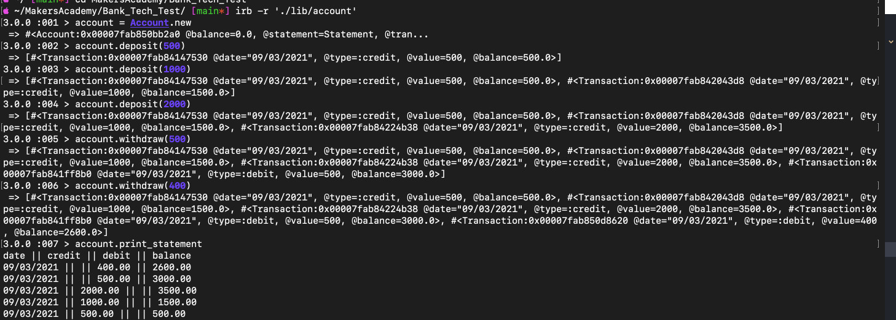
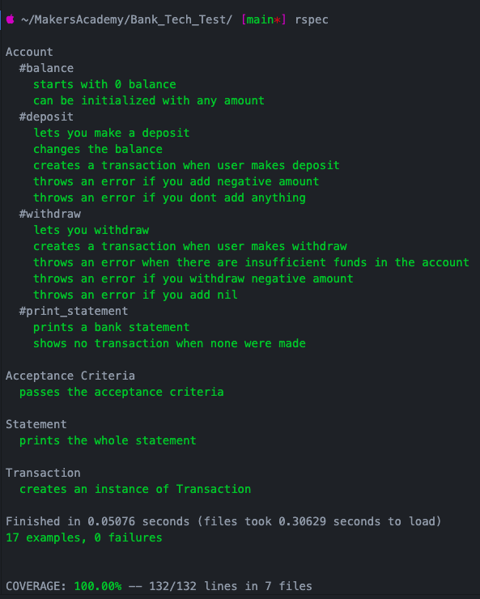

# Bank tech test

This test is for practicing OO design and TDD skills as well as producing a clean code.

## How to run

* Clone this repo
* Bundle install
* There are two ways of running this project:
    1. Open IRB and require `./lib/account`
      * `account = Account.new `
      * `account.deposit(100)`
      * `account.withdraw(50)`
      * `account.print_statement`
    2. `ruby bank.rb`

## Planning

* I started by creating user stories.
```
As a client
So I can put money in my account
I want to be able to deposit
```
```
As a client
So I can take money out of my account
I want to be able to withdraw
```
```
As a client
So I can see how much money I have
I want to print an account statement
```
```
As a client
So i know when i did what
I want to see the dates on my account statement
```
```
As a client
So i know when i withdrew
I want to see the date and the amount I withdrew on my account statement
```
```
As a client
So i know when i deposited
I want to see the date and the amount I credited on my account statement
```
```
As a client
So I know how much money I have in my account
I want to see my balance after every transaction on my account statement
```
* Organised them in tables to plan how I will structure my code.

 

 

 

## Example of the code running in IRB



## Coverage

* 17 tests , all passing, 100% coverage.


